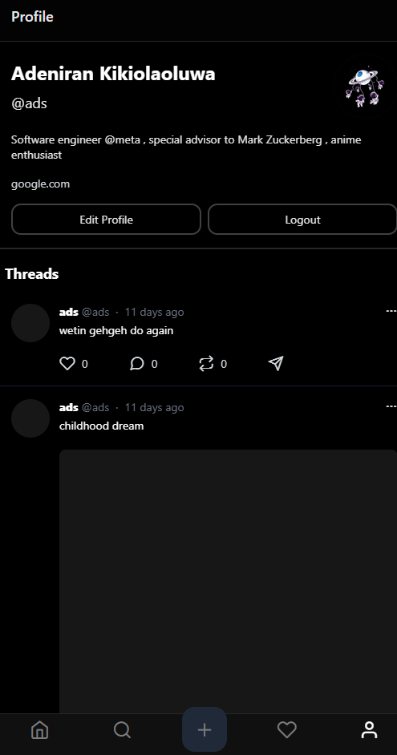
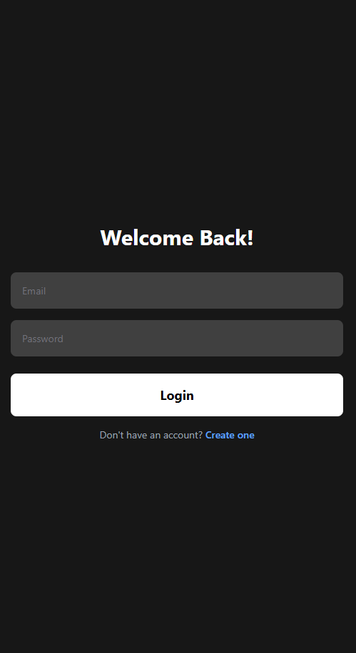

# Threads Clone (Expo + Supabase)

A simple Threads-style mobile app built with Expo Router, Supabase (Auth + DB + Storage), and NativeWind.

## Screenshots





## Features

- Email/password authentication (Supabase Auth)
- Home feed: fetch posts from Supabase
- Post details + replies (threaded replies via `parent_id`)
- Create a new post (optionally with an image uploaded to Supabase Storage)
- Profile view + edit (username, full name, bio, avatar upload)

Notes:
- `Search` and `Notifications` tabs exist but are currently basic placeholder screens.

## Tech Stack

- Expo SDK 54 + React Native
- Expo Router (file-based routing)
- Supabase (`@supabase/supabase-js`) for Auth/DB/Storage
- TanStack Query (`@tanstack/react-query`) for data fetching + caching
- NativeWind + Tailwind CSS for styling

## Getting Started

### Prerequisites

- Node.js (LTS recommended)
- Expo Go on a physical device, or Android Studio / Xcode simulators
- A Supabase project

### 1) Install dependencies

```bash
npm install
```

### 2) Configure environment variables

This project reads Supabase credentials from Expo public env vars (see `src/lib/supabase.ts`).

Create a `.env` file in the project root:

```bash
EXPO_PUBLIC_SUPABASE_URL=your-supabase-project-url
EXPO_PUBLIC_SUPABASE_ANON_KEY=your-supabase-anon-key
```

Important:
- Variables prefixed with `EXPO_PUBLIC_` are bundled into the app — do not put secrets here.

### 3) Supabase setup

The app expects:

- A `profiles` table (stores `id`, `username`, `full_name`, `bio`, `avatar_url`, ...)
- A `posts` table (stores `id`, `content`, `user_id`, `parent_id`, `images`, `created_at`, ...)
- Storage buckets:
	- `avatars` (profile pictures)
	- `media` (post images)

If you haven’t created these yet, create the tables/buckets in Supabase and ensure the Row Level Security (RLS) policies allow the operations you’re testing (read feed, create posts, update own profile, upload to buckets).

### 4) Run the app

```bash
# start the dev server
npm run start

# platform shortcuts
npm run android
npm run ios
npm run web
```

## Project Structure

```txt
src/
	app/                 # expo-router routes (auth, protected tabs, post details)
	components/          # UI components (post items, profile header, image wrappers)
	lib/                 # clients/utilities (Supabase client)
	providers/           # app providers (AuthProvider)
	services/            # Supabase query helpers (posts, profiles)
	types/               # generated Supabase types
```

## Troubleshooting

- App crashes on launch: make sure `.env` contains `EXPO_PUBLIC_SUPABASE_URL` and `EXPO_PUBLIC_SUPABASE_ANON_KEY`.
- Auth works but profile/posts fail: check your database schema + RLS policies in Supabase.
- Image upload fails: verify storage buckets (`avatars`, `media`) exist and allow uploads for your test users.

## Credits

Inspired by the Threads UI/UX pattern for learning purposes.
